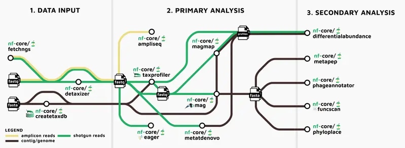

# nf-metaomics-daisychain



A Nextflow meta-pipeline for meta-omic data.

> [!TIP]
> Use `nf-core launch` to write the pipeline `params.yml` which can
> supplied as a workflow parameter : `<workflow>.params_file`.

## Usage

Parameters are supplied to child workflows through `params.yml` files. These
files can be generated with `nf-core launch` and supplied to the workflow.

```bash
nextflow run main.nf -params-file params.yml
```

> [!NOTE]
> Parameter files can be supplied for each workflow though the `<workflow>.params_file` config.
> `<workflow>.input` can be set to supply a samplesheet, or override the samplesheet provided by
> a previous workflow (`<workflow>.input` and previous workflow stages take precedence over
> samplesheets provided through `<workflow>.params_file`).

