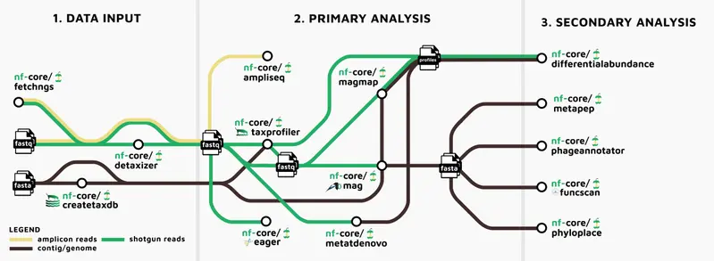
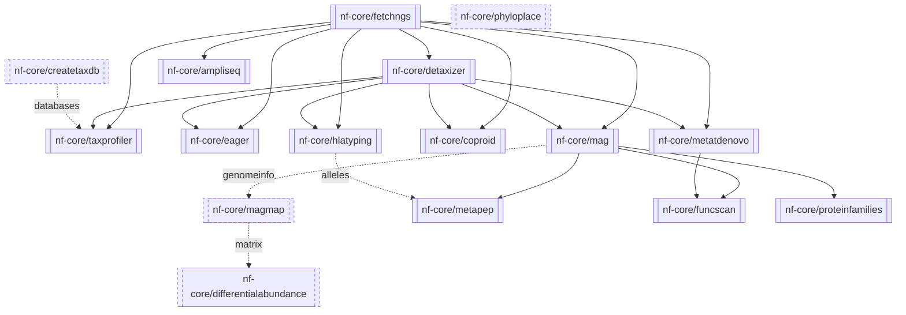

# nf-metaomics-daisychain

> [!IMPORTANT]
> This is work-in-progress and not yet ready for use.

A Nextflow meta-pipeline for meta-omic data.



> Metro map by [James Fellows Yates](https://github.com/jfy133).

> Meta pipeline based on the concept of [nf-cascade](https://github.com/mahesh-panchal/nf-cascade)

The diagram below reflects exactly what's wired in `main.nf` today - every solid
arrow is a chain this repo auto-generates a samplesheet for by default (still
overridable per-pipeline via `<workflow>.input`); every dotted arrow is an optional
extra flag layered on top of a pipeline that already has its own default input
(e.g. `--databases`, `--genomeinfo`, `--matrix`, `alleles`), not a samplesheet
source. Dashed-outline pipelines have no auto-wired upstream at all and always need
their own `.input`/`.params_file`. This shows what's *hooked up*, not what's been
run end-to-end - see `tests/chains.nf.test` for the subset that's actually been
verified with real data.


```mermaid
graph TD
    fetchngs[[nf-core/fetchngs]]
    detaxizer[[nf-core/detaxizer]]
    createtaxdb[[nf-core/createtaxdb]]
    ampliseq[[nf-core/ampliseq]]
    taxprofiler[[nf-core/taxprofiler]]
    eager[[nf-core/eager]]
    hlatyping[[nf-core/hlatyping]]
    coproid[[nf-core/coproid]]
    mag[[nf-core/mag]]
    magmap[[nf-core/magmap]]
    metatdenovo[[nf-core/metatdenovo]]
    differentialabundance[[nf-core/differentialabundance]]
    metapep[[nf-core/metapep]]
    funcscan[[nf-core/funcscan]]
    proteinfamilies[[nf-core/proteinfamilies]]
    phyloplace[[nf-core/phyloplace]]

    fetchngs --> detaxizer
    fetchngs --> ampliseq
    fetchngs --> taxprofiler
    detaxizer --> taxprofiler
    fetchngs --> eager
    detaxizer --> eager
    fetchngs --> hlatyping
    detaxizer --> hlatyping
    fetchngs --> coproid
    detaxizer --> coproid
    fetchngs --> mag
    detaxizer --> mag
    fetchngs --> metatdenovo
    detaxizer --> metatdenovo
    mag --> funcscan
    metatdenovo --> funcscan
    mag --> metapep
    mag --> proteinfamilies
    createtaxdb -.->|databases| taxprofiler
    hlatyping -.->|alleles| metapep
    mag -.->|genomeinfo| magmap
    magmap -.->|matrix| differentialabundance

    class createtaxdb,magmap,differentialabundance,phyloplace standalone
    classDef standalone stroke-dasharray: 4 4
```

> [!NOTE]
> `phyloplace` is drawn with no edges at all: its real CLI flag is
> `--phyloplace_input`, not `--input`, so `NEXTFLOW_RUN`'s auto-generated
> `--input` never reaches it - `phyloplace.params_file` is the only viable way
> to run it today. See the comment above its block in `main.nf`.

> [!TIP]
> Use `nf-core pipelines launch <pipeline>` to write the pipeline `params.yml` which can
> supplied as a workflow parameter : `<workflow>.params_file`.

## Usage

Choose which pipelines to run with the per-pipeline `enable_<pipeline>` boolean params,
e.g. `enable_fetchngs: true` / `enable_taxprofiler: true`. Each selected pipeline gets
its own `<workflow>.{input, params_file, wf_opts, add_config}` block, and a
`general.wf_opts` applies to every pipeline in the chain. See `meta-pipeline-params.yml`
for a worked example.

Parameters for each child pipeline are supplied through `params.yml` files. These
files can be generated with `nf-core pipelines launch <pipeline>` and supplied via
`<workflow>.params_file`.

```bash
nextflow run main.nf -params-file meta-pipeline-params.yml
```

> [!NOTE]
> Parameter files can be supplied for each workflow though the `<workflow>.params_file` config.
> `<workflow>.input` can be set to supply a samplesheet, or override the samplesheet provided by
> a previous workflow (`<workflow>.input` and previous workflow stages take precedence over
> samplesheets provided through `<workflow>.params_file`).

> [!NOTE]
> `nextflow_schema.json` runs preliminary checks before any pipeline starts: enabling a
> pipeline that has no auto-wired upstream in this chain (or whose upstream is itself
> disabled) requires that pipeline's own `.input`, `.params_file`, or a `-profile ...test...`
> in `.wf_opts` to be set, otherwise validation fails fast with a clear error instead of
> the pipeline failing deep into a run. A pipeline's own `-profile test` already bundles
> a complete, self-consistent example input (including things this repo can't derive for
> you, like a differentialabundance contrasts file or a phyloplace reference tree) - a
> quick way to try a pipeline you haven't wired up your own data for yet.

> [!WARNING]
> Please use absolute paths for all input files.

## Technical details

This meta-pipeline runs each child pipeline as `nextflow run nf-core/<pipeline>` in a
native `NEXTFLOW_RUN` process, and connects stages together by generating a samplesheet
from a previous stage's output directory (see `functions/local/utils.nf`). This is the
same approach demonstrated in [nf-cascade](https://github.com/mahesh-panchal/nf-cascade) -
see that repo's README and wiki for the technical background and a guided example of
adding a new pipeline to the chain.
